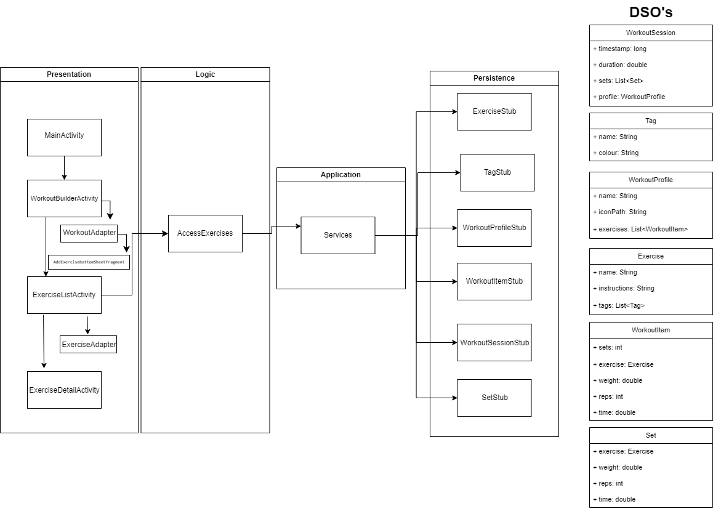

# Architecture

## Overview

Our architecture follows closely to the architecture from the [sample project](https://code.cs.umanitoba.ca/comp3350-winter2025/sample-project).

It contains five main packages:

- **Application:** Contains application-wide utilities. In this iteration, the only utility is the Services singleton, which manages the lifetime and access to the persistence classes.
- **Logic:** Contains all `AccessXXXX` classes, which interface with the persistence layer to access data models. In this iteration, only the `AccessExercises` class was needed. In the future, we may need additional logic classes to access other types of models.
- **Objects:** Contains all our data models for the application. More details in [Domain Specific Objects](#domain-specific-objects).
- **Persistence:** Contains our interface for the database. In this iteration, only a stub database is implemented. The stubs implement all the methods defined in the six interfaces under `persistence/`
- **Presentation:** Contains all the GUI classes which add functionality to the Android interface. This is the only package which makes use of Android dependencies. The presentation package is further divided into `activity`, `adapters`, and `fragments`. Activities are screens, adapters bridge the android UI elements with the code, and fragments are miscellaneous UI elements used in activities. 

# Domain Specific Objects

## WorkoutProfile

Contains information about a user-created workout. The information stored is:

- A user-defined name for the workout.
- A list of WorkoutItems, which is the sequence of activities to be completed in the workout.
- A path to an icon for the workout.

## WorkoutItem

Contains information about an activity as part of a workout. This includes:

- A reference to a known exercise in the database.
- A number of sets to be performed.
- If time-based, a duration in seconds. Otherwise, time is zero.
- If not time-based, a number of reps
- If the exercise involves weight, then a weight value is specified. Otherwise weight is zero.

## Exercise

Contains information about a specific exercise, including:

- The name of the exercise
- A list of tags
- Instructions for how to perform the exercise

## Tag

Represents a tag, attributed to exercises. It includes a display name and color.

## WorkoutSession

Contains data about a completed workout. The information contained is:

- A timestamp; when it was completed
- A duration; how long the workout took
- A list of sets. More details below.
- A reference to a WorkoutProfile object to identify which workout the session corresponds to.

## Set

Represents a recorded set from a workout session. Workouts are stored in sets, as this provides the flexibility to encode deviations in the amount of reps, weight, or time that was performed on a per-set basis. In other words, if a user could not finish their set, or decided to increase the weight, the database is flexible enough to support this level of detail.

A set contains the following information:

- A reference to an Exercise object
- The amount of weight that was used during the set. Zero if none
- The amount of repetitions performed. One if time-based.
- The amount of time performed, if time-based. Zero otherwise.

