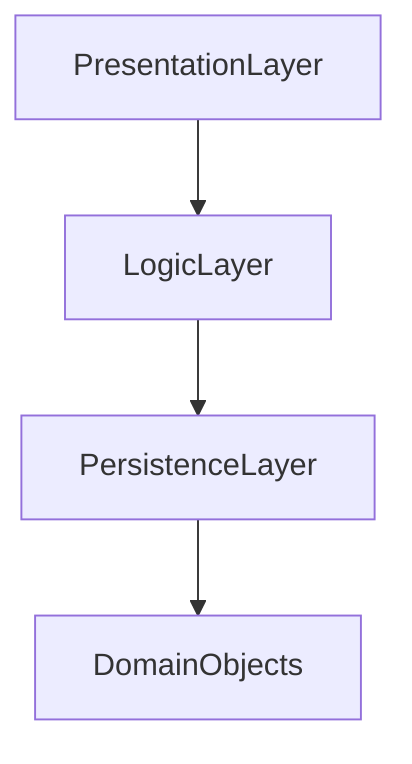

# GymBuddy Architecture Documentation

## Table of Contents

1. [Introduction](#introduction)
2. [Architecture Overview](#architecture-overview)
3. [Presentation Layer](#presentation-layer)
4. [Business Logic Layer](#business-logic-layer)
5. [Persistence Layer](#persistence-layer)
6. [Domain Objects](#domain-objects)
7. [Testing Architecture](#testing-architecture)
8. [Data Flow](#data-flow)
9. [Key Design Patterns](#key-design-patterns)

## Introduction

GymBuddy is an Android application that helps users plan, track, and manage their workout routines. This document describes the architecture of the application, explaining each component and how they interact.

## Architecture Overview

GymBuddy follows a layered architecture pattern with clear separation of concerns:

Each layer has specific responsibilities:

- **Presentation Layer**: User interface components
- **Business Logic Layer**: Application business rules
- **Persistence Layer**: Data storage and retrieval
- **Domain Objects**: Core data models shared across layers

## Presentation Layer

The Presentation layer contains UI components that users interact with.

### Components

- **Activities**

  - `BaseActivity`: Common functionality shared by all activities

    - Handles database initialization
    - Manages bottom navigation
    - Implements activity navigation logic

  - `MainActivity`: The entry point activity

    - Displays list of workout profiles
    - Initializes the HSQLDBHelper database connection
    - Entry point for application navigation

  - `WorkoutBuilderActivity`: Interface for creating/editing workout profiles

    - Creates new workout routines with exercises
    - Allows users to configure exercise details
    - Saves workout profiles to the database

  - `WorkoutLogActivity`: Shows workout history and logs

    - Displays list of completed workout sessions
    - Provides search functionality for workout logs
    - Links to detailed workout session views

  - `WorkoutLogDetailActivity`: Shows details of a specific workout session

    - Displays date, duration, and exercises performed
    - Shows performance metrics for each exercise
    - Visualizes workout data

  - `ExerciseListActivity`: Displays available exercises

    - Shows searchable list of all exercises
    - Allows selection of exercises for workout routines
    - Provides links to detailed exercise information

  - `ExerciseDetailActivity`: Shows detailed information about an exercise
    - Displays exercise instructions and images
    - Shows proper form and technique
    - Lists exercise tags and categories

- **Fragments**

  - `AddExerciseDialogFragment`: Dialog for adding exercises to workouts
    - Allows users to configure sets, reps, weight, or duration
    - Adapts UI based on exercise type (time-based or weight-based)
    - Validates input using InputValidator
    - Returns configured WorkoutItem to parent activity

- **Adapters**

  - `ExerciseAdapter`: Binds exercise data to RecyclerView

    - Displays exercise names, images, and tags
    - Implements clickable interface for selecting exercises
    - Creates and populates tag chips with appropriate styling
    - Supports filtering and search operations
    - Handles "View More" functionality for exercise details

  - `WorkoutProfileAdapter`: Displays workout profiles in list form

    - Shows workout name and exercise count
    - Renders profile data in card-based layout
    - Formats details text using locale settings
    - Used in MainActivity for profile selection

  - `WorkoutItemAdapter`: Shows configured exercises within a workout

    - Displays different layouts based on exercise type (time-based vs rep-based)
    - Shows sets, reps, weight for standard exercises
    - Shows duration for time-based exercises
    - Used in workout building and editing screens

  - `WorkoutLogAdapter`: Presents workout session history
    - Displays date, duration, and profile name for completed workouts
    - Implements click listener for workout log detail navigation
    - Supports dynamic data updates via notifyItemRangeChanged
    - Provides a setWorkoutSessions method for refreshing data

- **Presentation Utilities**

  - `AssetLoader`: Handles loading assets from application resources

    - Provides methods to load images from assets directory
    - Abstracts away input stream handling and error management
    - Returns Bitmap objects for use in UI components

  - `DSOBundler`: Data Structure Object bundling utility

    - Converts domain objects to/from Android Bundle objects
    - `bundleWorkoutItem()`: Serializes WorkoutItem to Bundle
    - `unbundleWorkoutItem()`: Deserializes Bundle to WorkoutItem
    - Facilitates data transfer between fragments and activities
    - Handles different data types based on exercise properties

  - `InputValidator`: Validates user inputs
    - Ensures exercise parameters (reps, sets, etc.) are valid
    - Provides feedback for UI error messages

### Responsibilities

- Display data to users
- Capture user input
- Delegate business operations to Logic layer
- Handle UI state and transitions
- Initialize database connection (in MainActivity)

## Business Logic Layer

The Logic layer contains the core application logic and business rules.

### Components

- **Managers**

  - `ExerciseManager`: Handles operations related to exercises

    - Retrieves and filters exercise data
    - Provides search functionality
    - Acts as intermediary between UI and persistence

  - `WorkoutManager`: Manages workout profiles and routines

    - Creates and modifies workout profiles
    - Validates workout configurations
    - Stores and retrieves workout data

  - `WorkoutSessionManager`: Tracks workout sessions and history
    - Records workout completion data
    - Retrieves historical workout information
    - Provides statistics and reporting functionality

- **Validators**

  - Input validation logic
  - Business rule enforcement

- **Logic Exceptions**
  - `InvalidRepsException`: Thrown when rep count is invalid
  - `InvalidSetsException`: Thrown when set count is invalid
  - `InvalidTimeException`: Thrown when duration is invalid
  - `InvalidWeightException`: Thrown when weight value is invalid

### Responsibilities

- Implement business rules
- Coordinate between UI and data access
- Validate user input
- Transform data between presentation and persistence formats

## Persistence Layer

The Persistence layer handles data storage and retrieval.

### Components

- **PersistenceManager**

  - Factory that creates appropriate database implementations
  - Switches between production and test implementations
  - Example methods: `getWorkoutDB()`, `getExerciseDB()`

- **Database Interfaces**

  - `IExerciseDB`: Contract for exercise data operations
  - `IWorkoutDB`: Contract for workout profile operations
  - `IWorkoutSessionDB`: Contract for workout session history

- **HSQLDB Implementations**

  - `HSQLDBHelper`: Manages database connections and initialization
    - Initialized by MainActivity during application startup
    - Provides database connection to other components
  - `ExerciseHSQLDB`: Implements `IExerciseDB` using HSQLDB
  - `WorkoutHSQLDB`: Implements `IWorkoutDB` using HSQLDB
  - `WorkoutSessionHSQLDB`: Implements `IWorkoutSessionDB` using HSQLDB

- **Stub Implementations**

  - In-memory implementations for testing
  - `ExerciseStub`, `WorkoutStub`, `WorkoutSessionStub`

- **Persistence Exceptions**
  - `DBException`: Wraps database-specific errors

### Database Connection Flow

1. `MainActivity` initializes the database by calling `HSQLDBHelper.getInstance(context).connect()`
2. `HSQLDBHelper` establishes the connection to the database
3. DAO classes (`ExerciseHSQLDB`, etc.) use `HSQLDBHelper.getConnection()`
4. `PersistenceManager` returns appropriate implementation based on `forProduction` flag

## Domain Objects

Domain objects represent the core data models used throughout the application.

### Key Classes

- **Exercise**: Represents a physical exercise

  - Properties: id, name, instructions, image path, tags, time-based flag, weight flag
  - Used by managers, database layers, and UI components

- **Tag**: Categorizes exercises

  - Properties: type, name, text color, background color
  - Used to filter and group exercises

- **WorkoutProfile**: Represents a workout routine configuration

  - Properties: id, name, icon path, list of workout items
  - Contains methods to manage workout items

- **WorkoutItem**: A specific exercise configuration within a workout

  - Properties: exercise, sets, reps, weight, duration
  - Different constructors for time-based vs. rep-based exercises

- **WorkoutSession**: Records a completed workout
  - Properties: id, start time, end time, profile id, list of performed items
  - Stores actual workout performance data

## Testing Architecture

The testing structure ensures code quality and proper functionality.

### Test Organization

- **Test Suites**

  - `AllTests`: Runs all unit tests
  - `IntegrationTestSuite`: Runs integration tests with database setup

- **Unit Tests**

  - Test individual components in isolation
  - Use stub implementations for external dependencies
  - Fast execution, no database required

- **Integration Tests**

  - Test interactions between components
  - Use in-memory database
  - All extend `IntegrationTestBase` for common setup

- **Test Utilities**
  - `TestUtils`: Helper methods for test setup/teardown
    - Creates mock Android Context for testing
    - Sets up in-memory database for integration tests
    - Provides helper methods for creating test objects

### Integration Test Flow

1. `IntegrationTestSuite.setUpSuite()` calls `TestUtils.initializeTestDatabase()`
2. `TestUtils` creates mock Android Context and initializes database
3. Individual tests run against this database
4. `IntegrationTestSuite.tearDownSuite()` calls `TestUtils.resetTestDatabase()`

## Data Flow

### User Creates a Workout Profile

1. User interacts with `WorkoutBuilderActivity`
2. Activity collects data and calls `WorkoutManager.saveWorkout()`
3. `WorkoutManager` validates input and formats data
4. `WorkoutManager` calls `PersistenceManager.getWorkoutDB().saveWorkout()`
5. `WorkoutHSQLDB` saves data to database via `HSQLDBHelper`
6. UI is updated with success/failure message

### User Views Exercise List

1. `ExerciseListActivity` calls `ExerciseManager.getAll()`
2. `ExerciseManager` calls `PersistenceManager.getExerciseDB().getAll()`
3. `ExerciseHSQLDB` queries database and returns `List<Exercise>`
4. `ExerciseManager` applies any business logic to the results
5. `ExerciseAdapter` binds the data to RecyclerView

## Key Design Patterns

### Singleton Pattern

- Used for `HSQLDBHelper` to ensure one database connection instance
- Manages shared resources efficiently

### Factory Pattern

- `PersistenceManager` acts as a factory creating database implementations
- Allows switching between production and test implementations

### Strategy Pattern

- Different database strategies (HSQLDB vs Stubs) can be used interchangeably
- Enables testing without actual database dependencies

### Repository Pattern

- DAO classes abstract data access details
- Provides clean interfaces for business logic to use

### Template Method Pattern

- `IntegrationTestBase` defines common test setup
- Specific test classes implement test-specific behaviors

## Complete Architecture Diagram

```mermaid
graph TD
    %% PRESENTATION LAYER
    subgraph presentation ["Presentation Layer"]
        subgraph activities ["Activities"]
            base_act[BaseActivity]
            main_act[MainActivity]
            workout_builder[WorkoutBuilderActivity]
            workout_log[WorkoutLogActivity]
            workout_detail[WorkoutLogDetailActivity]
            exercise_list[ExerciseListActivity]
            exercise_detail[ExerciseDetailActivity]

            base_act -->|extends| main_act
            base_act -->|extends| workout_builder
            base_act -->|extends| workout_log
            base_act -->|extends| exercise_list
            workout_log -->|navigates to| workout_detail
            exercise_list -->|navigates to| exercise_detail
        end

        subgraph fragments ["Fragments"]
            add_exercise[AddExerciseDialogFragment]

            workout_builder -->|hosts| add_exercise
        end

        subgraph adapters ["Adapters"]
            exercise_adapter[ExerciseAdapter]
            profile_adapter[WorkoutProfileAdapter]
            item_adapter[WorkoutItemAdapter]
            log_adapter[WorkoutLogAdapter]

            main_act -->|uses| profile_adapter
            exercise_list -->|uses| exercise_adapter
        end

        subgraph utils ["Presentation Utilities"]
            asset_loader[AssetLoader]
            dso_bundler[DSOBundler]
            input_validator[InputValidator]

            add_exercise -->|validates with| input_validator
            exercise_adapter -->|loads images with| asset_loader
            add_exercise -->|bundles data with| dso_bundler
        end
    end

    %% LOGIC LAYER
    subgraph logic ["Business Logic Layer"]
        subgraph managers ["Managers"]
            exercise_mgr[ExerciseManager]
            workout_mgr[WorkoutManager]
            session_mgr[WorkoutSessionManager]
        end

        subgraph validators ["Validators"]
            business_validator[Business Validators]
        end

        subgraph logic_exceptions ["Logic Exceptions"]
            validation_exception[Validation Exceptions]
            invalid_reps[InvalidRepsException]
            invalid_sets[InvalidSetsException]
            invalid_time[InvalidTimeException]
            invalid_weight[InvalidWeightException]
        end

        managers -->|throws| logic_exceptions
        managers -->|uses| validators
    end

    %% PERSISTENCE LAYER
    subgraph persistence ["Persistence Layer"]
        persistence_mgr[PersistenceManager]

        subgraph interfaces ["Database Interfaces"]
            exercise_db[IExerciseDB]
            workout_db[IWorkoutDB]
            session_db[IWorkoutSessionDB]
        end

        subgraph hsqldb_impl ["HSQLDB Implementations"]
            db_helper[HSQLDBHelper]
            exercise_hsql[ExerciseHSQLDB]
            workout_hsql[WorkoutHSQLDB]
            session_hsql[WorkoutSessionHSQLDB]

            db_helper -->|provides connection to| exercise_hsql
            db_helper -->|provides connection to| workout_hsql
            db_helper -->|provides connection to| session_hsql
            main_act -->|initializes| db_helper
        end

        subgraph stubs ["Stub Implementations"]
            exercise_stub[ExerciseStub]
            workout_stub[WorkoutStub]
            session_stub[WorkoutSessionStub]
        end

        subgraph db_exceptions ["Persistence Exceptions"]
            db_exception[DBException]
        end

        persistence_mgr -->|creates| interfaces
        exercise_db -.->|implemented by| exercise_hsql
        exercise_db -.->|implemented by| exercise_stub
        workout_db -.->|implemented by| workout_hsql
        workout_db -.->|implemented by| workout_stub
        session_db -.->|implemented by| session_hsql
        session_db -.->|implemented by| session_stub

        hsqldb_impl -->|throws| db_exceptions
    end

    %% DOMAIN OBJECTS
    subgraph domain ["Domain Objects"]
        exercise_obj[Exercise]
        tag_obj[Tag]
        workout_profile[WorkoutProfile]
        workout_item[WorkoutItem]
        workout_session[WorkoutSession]

        exercise_obj -->|has many| tag_obj
        workout_profile -->|contains| workout_item
        workout_item -->|references| exercise_obj
        workout_session -->|contains| workout_item
        workout_session -->|references| workout_profile
    end

    %% TESTING LAYER
    subgraph testing ["Testing Architecture"]
        subgraph test_suites ["Test Suites"]
            all_tests[AllTests]
            integration_suite[IntegrationTestSuite]
        end

        subgraph integration_tests ["Integration Tests"]
            exercise_mgr_int[ExerciseManagerIntegrationTest]
            workout_mgr_int[WorkoutManagerIntegrationTest]
            session_mgr_int[WorkoutSessionManagerIntegrationTest]

            integration_base[IntegrationTestBase]
            integration_base -.->|extended by| exercise_mgr_int
            integration_base -.->|extended by| workout_mgr_int
            integration_base -.->|extended by| session_mgr_int
        end

        subgraph unit_tests ["Unit Tests"]
            domain_tests[Domain Object Tests]
            manager_tests[Manager Tests]
        end

        subgraph test_utils ["Test Utilities"]
            test_utils_class[TestUtils]
        end

        integration_suite -->|runs| integration_tests
        all_tests -->|runs| unit_tests
        integration_tests -->|uses| test_utils_class
    end

    %% CROSS-LAYER RELATIONSHIPS
    activities -->|use| managers
    fragments -->|use| managers

    managers -->|use| persistence_mgr
    exercise_mgr -->|accesses| exercise_db
    workout_mgr -->|accesses| workout_db
    session_mgr -->|accesses| session_db

    persistence_mgr -->|toggles| forProduction[Production vs Test Mode]
    forProduction -->|true| hsqldb_impl
    forProduction -->|false| stubs

    exercise_adapter -->|displays| exercise_obj
    profile_adapter -->|displays| workout_profile
    item_adapter -->|displays| workout_item
    log_adapter -->|displays| workout_session

    %% TEST RELATIONSHIPS
    integration_tests -->|tests| managers
    domain_tests -->|tests| domain
    test_utils_class -->|initializes test| db_helper

    %% KEY APP FLOW
    user[User] -->|interacts with| activities
    activities -->|delegate to| managers
    managers -->|perform business logic on| domain
    managers -->|persist via| persistence_mgr
    persistence_mgr -->|stores in| database[(Database)]
```

> For more details on implementation, refer to the codebase and [architecture.svg](architecture.svg) diagram.
