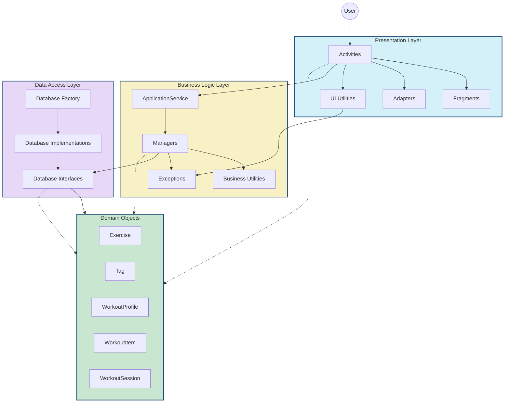

# GymBuddy - Comprehensive Architecture Documentation

## Executive Summary

GymBuddy is an Android fitness application built on a robust three-tier architecture that enables users to browse exercises, create custom workouts, track workout sessions, and view workout history. This document details the architectural design, component interactions, and implementation patterns that provide the foundation for the application's maintainability, testability, and extensibility.

## Table of Contents

1. Architecture Overview
2. Core Architecture Principles
3. Architectural Layers
   - Presentation Layer
   - Business Logic Layer
   - Data Access Layer
   - Domain Objects
4. Component Interactions
5. Data Flows
6. Code Organization
7. Exception Handling Strategy
8. Design Patterns
9. Testing Strategy
10. Future Enhancements
11. Technical Glossary

## Architecture Overview


GymBuddy follows a **strict three-tier architecture** with clear separation of concerns:

```
┌─────────────────────┐
│  Presentation Layer │  UI components, Activities, Fragments, Adapters
├─────────────────────┤
│ Business Logic Layer│  Managers, Application Services, Business Rules
├─────────────────────┤
│   Data Access Layer │  Database Interfaces, Implementations
└─────────────────────┘
        │   │   │
        ▼   ▼   ▼
┌─────────────────────┐
│    Domain Objects   │  Core business entities shared across layers
└─────────────────────┘
```

This architecture enables:
- **Independent evolution** of each layer
- **Simplified testing** through clear interfaces
- **Consistent data flow** throughout the application
- **Technology independence** for each architectural concern

## Core Architecture Principles

### 1. Unidirectional Dependencies

Dependencies always flow **downward** from Presentation to Business Logic to Data Access. Higher layers depend on lower layers, never the reverse.

### 2. Interface-Based Communication

Layers communicate through interfaces, enabling:
- Multiple implementations (production, testing)
- Loose coupling between components
- Easier mocking for unit tests

### 3. Shared Domain Model

Domain objects are shared across all layers to maintain consistency and avoid duplication.

### 4. Centralized Error Handling

A comprehensive exception hierarchy with layer-specific exceptions ensures:
- Appropriate error translation between layers
- Consistent error handling at the UI level
- Detailed error information for debugging

### 5. Service Locator Pattern

The `ApplicationService` provides centralized access to all managers, ensuring consistent state and simplified access.

## Architectural Layers

### Presentation Layer

The Presentation Layer handles user interface rendering and user interactions.

#### Components

1. **Activities**
   - `MainActivity`: Home screen with workout list
   - `WorkoutBuilderActivity`: Create and edit workout profiles
   - `WorkoutPlayerActivity`: Execute workout sessions
   - `ExerciseDetailActivity`: Display exercise details
   - `ExerciseListActivity`: Browse and search exercises
   - `WorkoutLogActivity`: View workout history
   - `WorkoutLogDetailActivity`: View session details
   - `StartWorkoutListActivity`: Preview before starting workout

2. **Fragments**
   - `AddExerciseDialogFragment`: Configure exercise parameters

3. **Adapters**
   - `WorkoutProfileAdapter`: Display workout profiles in lists
   - `WorkoutItemAdapter`: Display exercises within a workout
   - `ExerciseAdapter`: Display exercise list
   - `WorkoutLogAdapter`: Display workout history

4. **UI Utilities**
   - `ErrorHandler`: Centralized error handling
   - `ErrorDisplay`: Interface for error display strategies
   - `ToastErrorDisplay`: Toast-based error display
   - `DSOBundler`: Bundle domain objects for intent transfers
   - `NavigationHelper`: Handle screen navigation
   - `AssetLoader`: Load images from assets
   - `FileHandler`: Handle file operations

#### Implementation Example

Fetching and displaying exercise details in `ExerciseDetailActivity`:

```java
// Get the exercise details using the manager
ExerciseManager exerciseManager = ApplicationService.getInstance().getExerciseManager();
Exercise exercise = exerciseManager.getExerciseByID(exerciseID);

// Update the views with exercise info
binding.exerciseName.setText(exercise.getName());
binding.exerciseInstructions.setText(exercise.getInstructions());

// Load exercise image
AssetLoader.loadImageFromPath(this, binding.exerciseImage, exercise.getImagePath());

// Display exercise tags
displayTags(exercise.getTags());
```

### Business Logic Layer

The Business Logic Layer contains application logic, validations, and orchestrates operations.

#### Components

1. **Application Service**
   - `ApplicationService`: Central service locator (Singleton)
   - Provides access to all managers
   - Manages system initialization and lifecycle

2. **Managers**
   - `ExerciseManager`: Handle exercise-related operations
   - `WorkoutManager`: Handle workout profile operations
   - `WorkoutSessionManager`: Handle workout session operations

3. **Business Utilities**
   - `InputValidator`: Validate user inputs
   - `StringFormatter`: Format data for display
   - `ConfigLoader`: Load configuration data
   - `ValidationMessages`: Centralize validation messages
   - `WorkoutPlaybackController`: Control workout execution flow

4. **Business Exceptions**
   - `BusinessException`: Base exception 
   - `DataAccessException`: Database errors
   - `ExerciseAccessException`: Exercise-specific errors
   - `WorkoutAccessException`: Workout-specific errors
   - `InvalidInputException`: Input validation errors
   - `ApplicationInitException`: Initialization errors

#### Implementation Example

Exercise retrieval with error handling in `ExerciseManager`:

```java
public Exercise getExerciseByID(int id) {
    try {
        Exercise exercise = exerciseDB.getExerciseByID(id);
        if (exercise == null) {
            throw new ExerciseAccessException("Exercise not found with ID: " + id);
        }
        return exercise;
    } catch (DBException e) {
        Timber.tag(TAG).e(e, "Failed to retrieve exercise with ID %d", id);
        throw new ExerciseAccessException("Failed to retrieve exercise with ID: " + id, e);
    }
}
```

### Data Access Layer

The Data Access Layer handles data persistence and retrieval, abstracting the database details.

#### Components

1. **Database Interfaces**
   - `IDatabase`: Base database operations
   - `IExerciseDB`: Exercise database operations
   - `IWorkoutDB`: Workout profile operations
   - `IWorkoutSessionDB`: Workout session operations

2. **Database Implementations**
   - `HSQLDatabase`: Database connection management
   - `ExerciseHSQLDB`: HSQL implementation for exercises
   - `WorkoutHSQLDB`: HSQL implementation for workouts
   - `WorkoutSessionHSQLDB`: HSQL implementation for sessions
   - Various stubs for testing (e.g., `ExerciseStub`)

3. **Factory & Management**
   - `DatabaseFactory`: Create appropriate DB implementations
   - `PersistenceManager`: Manage database lifecycle

#### Implementation Example

Saving a workout in `WorkoutDAO`:

```java
@Override
public void saveWorkout(WorkoutProfile profile) throws DBException {
    try {
        connection.setAutoCommit(false);
        
        if (profile.getID() == -1) {
            // Insert new profile
            int profileId = insertNewProfile(profile);
            insertWorkoutItems(profileId, profile.getWorkoutItems());
        } else {
            // Update existing profile
            updateProfile(profile);
            updateWorkoutItems(profile.getID(), profile.getWorkoutItems());
        }
        
        connection.commit();
    } catch (SQLException e) {
        try {
            connection.rollback();
        } catch (SQLException rollbackEx) {
            throw new DBException("Failed to rollback transaction: " + rollbackEx.getMessage(), rollbackEx);
        }
        throw new DBException("Failed to save workout: " + e.getMessage(), e);
    } finally {
        try {
            connection.setAutoCommit(true);
        } catch (SQLException e) {
            throw new DBException("Failed to reset auto-commit: " + e.getMessage(), e);
        }
    }
}
```

### Domain Objects

Domain Objects represent core business entities shared across all layers.

#### Core Domain Objects

- **Exercise**: Physical exercise with name, instructions, properties
  - Properties: id, name, instructions, imagePath, tags, isTimeBased, hasWeight
  
- **Tag**: Categories for exercises with display properties
  - Properties: type (enum: DIFFICULTY, MUSCLE_GROUP, etc.), name, textColor, bgColor
  
- **WorkoutProfile**: Complete workout definition
  - Properties: id, name, iconPath, workoutItems, isDeleted
  
- **WorkoutItem**: Exercise with specific parameters
  - Properties: exercise, sets, reps, weight, time
  
- **WorkoutSession**: Record of a completed workout
  - Properties: id, startTime, endTime, sessionItems, profile

#### Implementation Example

Domain object relationships in `WorkoutItem`:

```java
// Constructor for rep-based workout with weight
public WorkoutItem(Exercise exercise, int sets, int reps, double weight) {
    this(exercise, sets, reps, weight, 0.0);
}

// Constructor for time-based workout
public WorkoutItem(Exercise exercise, int sets, double time) {
    this(exercise, sets, 0, 0.0, time);
}

// Returns whether this is a time-based exercise
public boolean isTimeBased() {
    return exercise.isTimeBased();
}

// Returns whether this exercise has weight
public boolean hasWeight() { 
    return exercise.hasWeight(); 
}
```

## Component Interactions

### Detailed Component Diagram



### Key Interaction Patterns

1. **Service Locator Access**
   - Activities/Fragments access managers through `ApplicationService.getInstance()`
   - Ensures consistent access to business logic components

2. **Manager-Repository Communication**
   - Managers use database interfaces to perform data operations
   - Errors from data layer are translated to business exceptions

3. **Domain Object Flow**
   - Domain objects flow up from data layer to business layer to presentation
   - Domain objects flow down during create/update operations

4. **Error Propagation**
   - Low-level exceptions are caught and wrapped in domain-specific exceptions
   - Presentation layer catches business exceptions via centralized ErrorHandler

## Data Flows

### 1. Viewing Exercise Details

```
User selects exercise in ExerciseListActivity
  │
  ▼
ExerciseDetailActivity created with exerciseID
  │
  ▼
ExerciseDetailActivity calls ApplicationService.getInstance().getExerciseManager()
  │
  ▼
ExerciseManager.getExerciseByID(exerciseID) called
  │
  ▼
ExerciseManager calls IExerciseDB.getExerciseByID(id)
  │
  ▼
Database implementation retrieves exercise data
  │
  ▼
Exercise object flows back up through the layers
  │
  ▼
ExerciseDetailActivity displays exercise details
```

### 2. Building a Workout

```
User creates workout in WorkoutBuilderActivity
  │
  ▼
User clicks FAB to add exercise → ExerciseListActivity launched
  │
  ▼
User selects exercise → Returns to WorkoutBuilderActivity
  │
  ▼
AddExerciseDialogFragment opened to configure parameters
  │
  ▼
User submits parameters → WorkoutItem created and added to list
  │
  ▼
User saves workout → WorkoutBuilderActivity validates input
  │
  ▼
WorkoutProfile created with name, icon, and workout items
  │
  ▼
ApplicationService.getInstance().getWorkoutManager().saveWorkout(profile) called
  │
  ▼
WorkoutManager calls IWorkoutDB.saveWorkout(profile)
  │
  ▼
Database implementation stores workout in database
  │
  ▼
Confirmation shown to user and navigation to home screen
```

### 3. Executing a Workout

```
User selects workout in MainActivity
  │
  ▼
StartWorkoutListActivity shows workout details
  │
  ▼
User clicks Start Workout → WorkoutPlayerActivity launched
  │
  ▼
WorkoutPlaybackController created to manage workout flow
  │
  ▼
User completes exercises one by one
  │
  ▼
On completion, WorkoutSession created with start/end times
  │
  ▼
WorkoutSessionManager.saveSession(session) called
  │
  ▼
Database implementation stores session history
  │
  ▼
Confirmation shown and navigation back to home screen
```

## Code Organization

The codebase is organized into packages that align with the architectural layers:

```
comp3350.gymbuddy/
├── logic/                      # Business Logic Layer
│   ├── ApplicationService.java # Central service locator
│   ├── exception/              # Business exceptions
│   ├── managers/               # Business managers
│   └── util/                   # Business utilities
├── objects/                    # Domain Objects
│   ├── Exercise.java
│   ├── Tag.java
│   ├── WorkoutItem.java
│   ├── WorkoutProfile.java
│   └── WorkoutSession.java
├── persistence/                # Data Access Layer
│   ├── PersistenceManager.java
│   ├── exception/              # Database exceptions
│   ├── factory/                # Database factory
│   ├── hsqldb/                 # HSQL implementations
│   ├── interfaces/             # Database interfaces
│   ├── stubs/                  # Test stubs
│   └── util/                   # Persistence utilities
└── presentation/               # Presentation Layer
    ├── activity/               # Activities
    ├── adapters/               # RecyclerView adapters
    ├── fragments/              # Fragments
    └── util/                   # UI utilities
```

## Exception Handling Strategy

GymBuddy uses a comprehensive exception handling strategy that ensures:

1. **Layer-Appropriate Exceptions**
   - Data layer: `DBException` for database issues
   - Business layer: `BusinessException` hierarchy for domain-specific errors
   - Presentation layer: User-friendly error displays

2. **Exception Translation**
   - Lower-layer exceptions are caught and wrapped in higher-level exceptions
   - Additional context is added at each level

3. **Centralized Error Handling**
   - `ErrorHandler` provides consistent error handling at UI level
   - Pluggable error display strategies (e.g., `ToastErrorDisplay`)

4. **Structured Exception Hierarchy**

```
BusinessException
  ├── DataAccessException
  │     ├── ExerciseAccessException
  │     ├── WorkoutAccessException
  │     └── WorkoutSessionAccessException
  ├── InvalidInputException
  │     ├── InvalidNameException
  │     ├── InvalidRepsException
  │     ├── InvalidSetsException
  │     ├── InvalidTimeException
  │     └── InvalidWeightException
  └── ApplicationInitException
```

## Design Patterns

GymBuddy implements several design patterns to ensure maintainability and extensibility:

### 1. Service Locator Pattern

```java
// Access point for all managers
public class ApplicationService {
    private static ApplicationService instance;
    
    public static ApplicationService getInstance() {
        if (instance == null) {
            instance = new ApplicationService();
        }
        return instance;
    }
    
    // Access to managers
    public ExerciseManager getExerciseManager() { ... }
}
```

### 2. Repository Pattern

```java
// Interface defining data operations
public interface IWorkoutDB {
    List<WorkoutProfile> getAll() throws DBException;
    WorkoutProfile getWorkoutProfileById(int id) throws DBException;
    void saveWorkout(WorkoutProfile profile) throws DBException;
    void deleteWorkout(int id) throws DBException;
}
```

### 3. Factory Pattern

```java
public class DatabaseFactory {
    public IExerciseDB createExerciseDB() {
        return new ExerciseHSQLDB(getConnection());
    }
    
    public IWorkoutDB createWorkoutDB() {
        return new WorkoutHSQLDB(getConnection(), createExerciseDB());
    }
}
```

### 4. Builder Pattern

```java
// Configuration builder
ConfigLoader config = ConfigLoader.builder()
    .scriptPath("db/create_tables.sql")
    .configPath("db/db.properties")
    .testMode(false)
    .dbAlreadyExists(false)
    .build();
```

### 5. Strategy Pattern

```java
// Different error display strategies
ErrorHandler handler = new ErrorHandler(new ToastErrorDisplay(context));
// Could also use: new DialogErrorDisplay(context)
```

### 6. MVC/MVP Pattern

- Activities/Fragments as Controllers/Presenters
- XML layouts as Views
- Domain objects as Models

## Testing Strategy

The architecture enables comprehensive testing at each layer:

### 1. Unit Testing

- **Business Layer**: Test managers with mocked repositories
- **Data Layer**: Test implementations with in-memory database
- **Domain Objects**: Test domain object behavior directly

### 2. Integration Testing

- Test interaction between managers and actual database implementations
- Test complete workflows across layers

### 3. UI Testing

- Test UI components with Espresso
- Mock business layer dependencies

### 4. Test Doubles

- **Stubs**: `ExerciseStub`, `WorkoutStub`, etc. for testing
- Configurable via PersistenceManager for testing environments

## Future Enhancements

The architecture is designed to accommodate several possible enhancements:

### 1. Remote Data Source

- Add remote data sources behind existing interfaces
- Implement caching strategy in repositories

### 2. Dependency Injection

- Replace Service Locator with proper DI framework (Dagger/Hilt)
- Improve testability and reduce coupling

### 3. Reactive Programming

- Implement LiveData/Flow for reactive data streams
- Improve UI responsiveness and state management

### 4. Modular Architecture

- Split into feature modules for better team collaboration
- Improve build times with parallel compilation

## Technical Glossary

- **Service Locator**: Design pattern that provides a central registry for services
- **Repository**: Mediates between domain and data mapping layers
- **Factory**: Creates objects without specifying concrete class
- **Strategy**: Defines family of algorithms, encapsulates each one, makes them interchangeable
- **HSQLDB**: HyperSQL Database, a lightweight relational database engine
- **Domain Object**: Core business entities that represent the problem domain
- **DAO**: Data Access Object, provides abstract interface to database
- **Stub**: Simplified implementation used for testing

## Architecture Diagram

