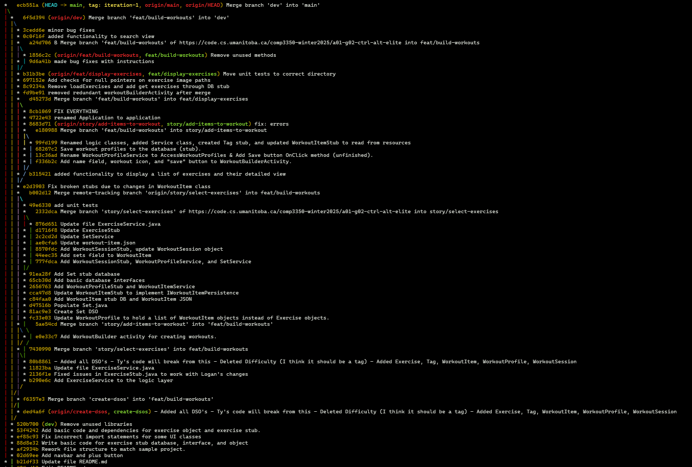

# Branching Strategy

Our team follows a structured branching strategy on GitLab to manage development effectively. Work begins with defining features, which are then broken down into user stories and further subdivided into developer tasks. Our primary branches are `main` and `dev`, with all active development occurring in feature branches that originate from `dev`. Each feature branch, named using the `feat/` prefix (e.g., `feat/build-workouts`), serves as the basis for user story branches, which follow the `story/` prefix (e.g., `story/add-items-to-workout`). Developers work on user story branches individually when possible, committing task-by-task until the story is complete. Occasionally, if a change doesn't fit neatly into a user story, we create a branch without a prefix (e.g., `create-dsos`). Once a feature is fully developed and tested, it is merged into `dev`. When preparing for a release, `dev` is merged into `main` and tagged accordingly.

Below is all the branches and commits leading up to the release of iteration 1.

