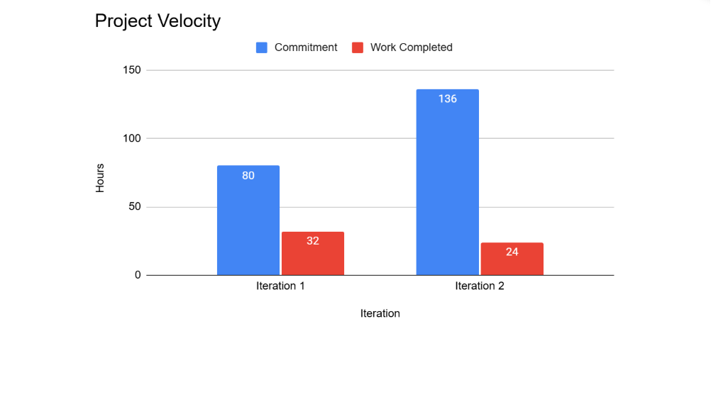

## Issues from Iteration 2 and Solutions

One thing that did not go well this iteration is we miscalculated how difficult it would be to refactor the database to match the [guide] given to us near the end of the iteration. Logan decided to create a new branch and rewrite the database. However, other team members still had the old implementations on their branches, with some making modifications. Logan ran into a plethora of issues as he tried reworking the code, but to no avail. Fifteen minutes before the deadline, Logan decided to revert back to the old implementation, copy-pasting the files from the old commits. Expectedly, many merge conflicts arose when we tried to merge our branches. One branch, `architecture`, contained our documentation for the new architecture, as well as improved unit testing. Due to the conflicts, we were unable to include these changes in the final submission. These issues meant that our final submission did not contain any new documentation, and many of our tests were failing.

This iteration, we aim to improve the situation by resolving the conflicts and merging the changes (we’ve already completed this). We also plan to avoid making large changes to the project architecture at such a late point in the iteration.

Another thing that made things more difficult was that our meeting with Lauren to review our code was scheduled less than a week before the deadline. That meeting, we identified many issues with our architecture and code patterns, but there wasn’t much time to fix them. If we ever do another meeting with Lauren, we believe we should schedule it earlier so there’s time to incorporate the feedback.

## Goals for Iteration 3

Overall, our goals for iteration 3 are as follows:

- Set aside the last two days for low-risk fixes and enhancements. Do not make large structural changes during this time.
- The last hour should be left for preparing the release, such as creating the APK, writing the release description, and merging onto main. Do not use this time to troubleshoot bugs unless absolutely necessary.
- If we meet with Lauren for a review, it should ideally be two weeks before the iteration deadline.

## Project Velocity for Features

**Committed features in iteration 1:**
- Building workouts (partially complete), 1 week estimate  
- Keep a log of past workouts (not complete), 3 day estimate  
- **Total time estimate:** ~10 days = 80 hrs  
- **Total completed:** ~3 days = ~32 hrs  

**Committed features in iteration 2:**
- Start a workout (not complete), 2 week estimate  
- Keep a log of past workouts (complete), 3 day estimate  
- **Total time estimate:** ~17 days = 136 hrs  
- **Total completed:** 3 days = 24 hrs  

To estimate our velocity for iteration 3, we will take the average amount of time spent on the previous iterations, which would be **28 hours of work**. However, it’s important to note that our time tracking may not have been as thorough as it should have been. In both iterations, we may not have logged all the time spent on features, which means the actual time spent on tasks may be higher than what was recorded and some tasks may have taken more effort than reflected in the tracked hours.

This lack of detailed time tracking could have led to underestimation of effort and inaccurate planning. To address this, we will:

- Improve time tracking by ensuring all team members log their hours consistently.
- Plan conservatively for iteration 3, committing to 28 hours of work while remaining flexible to adjust if tasks take longer than expected.

  
*Figure: Visual representation of project velocity across iterations.*
